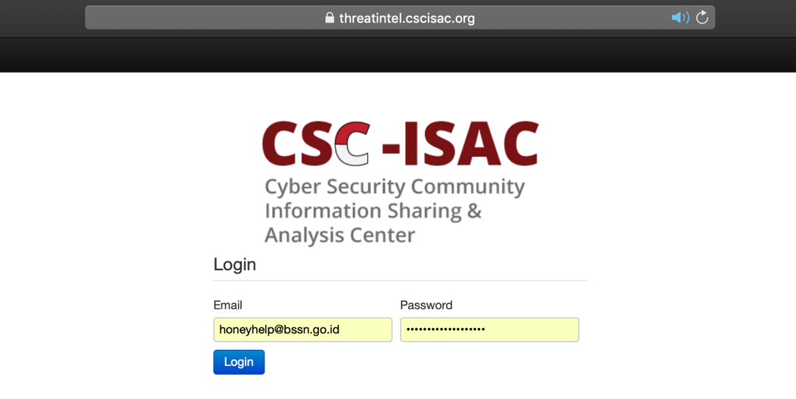
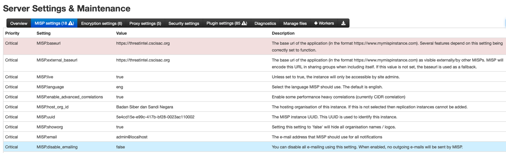
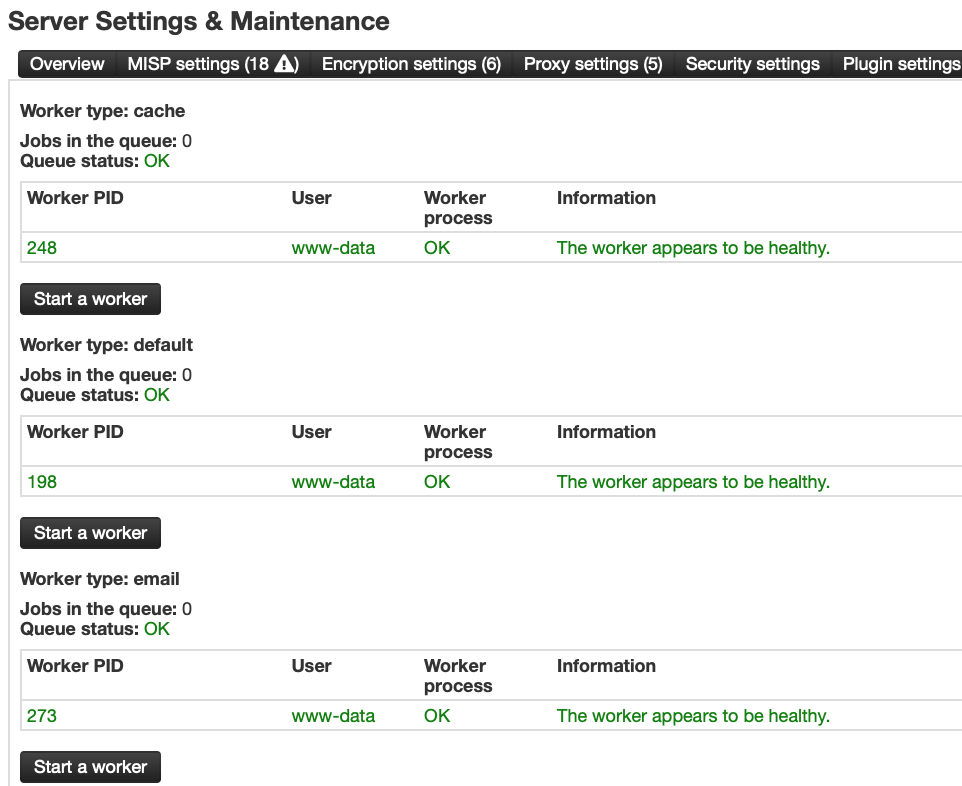
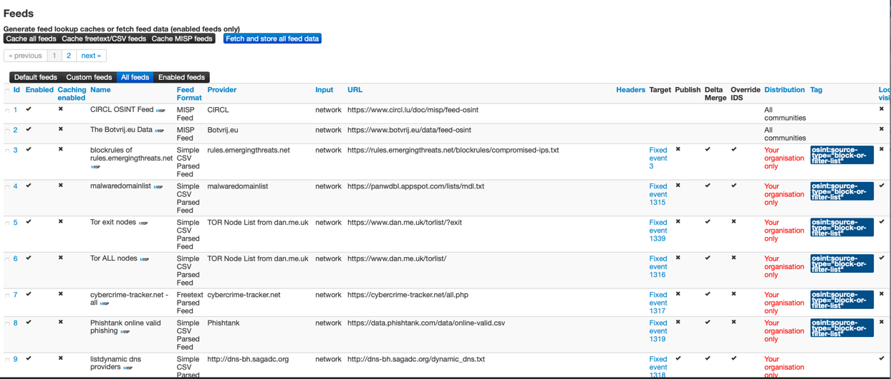
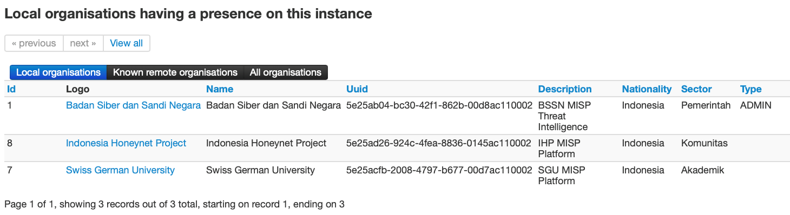
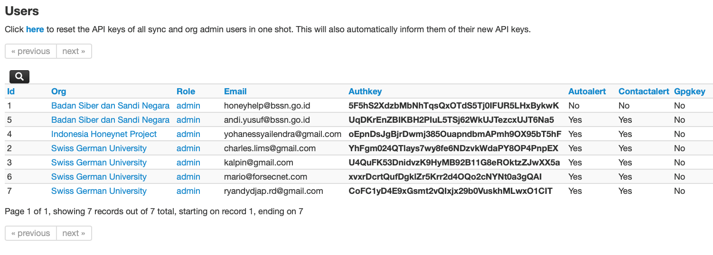

Customization
=============

In this page, there will be some customization for MISP and Honeynet Sensor Integration

MISP Customization Guideline
^^^^^^^^^^^^^^^^^^^^^^^^^^^^

1.	Open your terminal then see your IP Address configuration

.. code-block:: RST

  $ ifconfig

2.	Open MISP Dashboard (from IP that you have), and using default username : admin@admin.test , password : admin. For this configuration related by CSCISAC MISP.

3.	Setting your baseurl (IP or Domain configuration) on server setting and maintenance then tab MISP Setting. Next setting value “false” on MISP disable emailing.

4.	Make sure your worker is running well with green notification and worker process is “OK”

5.	Enable your MISP Feeds Server on Sync Actions, then enable your MISP feed need

6.	Add new organizations on your MISP in tab administrations then add organisations.

7.	Add new users on your MISP, same like your add new organizations in tab administrations then add users.

Honeynet Sensor Integration
^^^^^^^^^^^^^^^^^^^^^^^^^^^

Honeynet Sensor integration customize here

