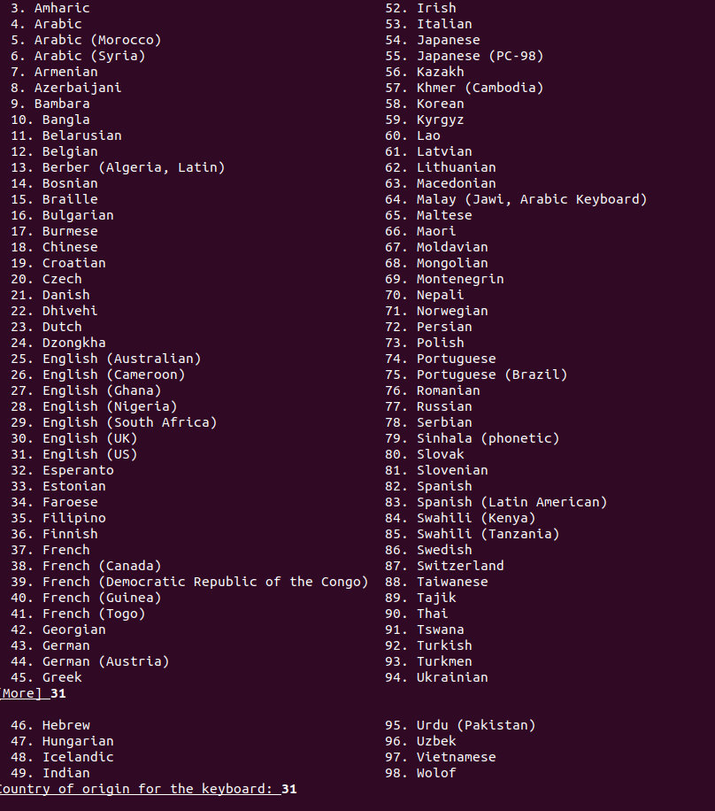
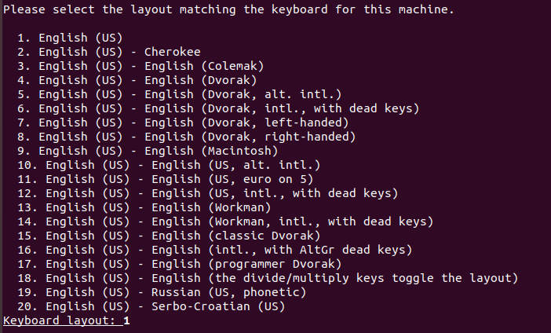
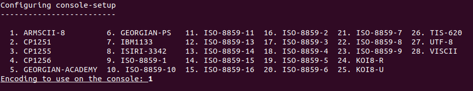
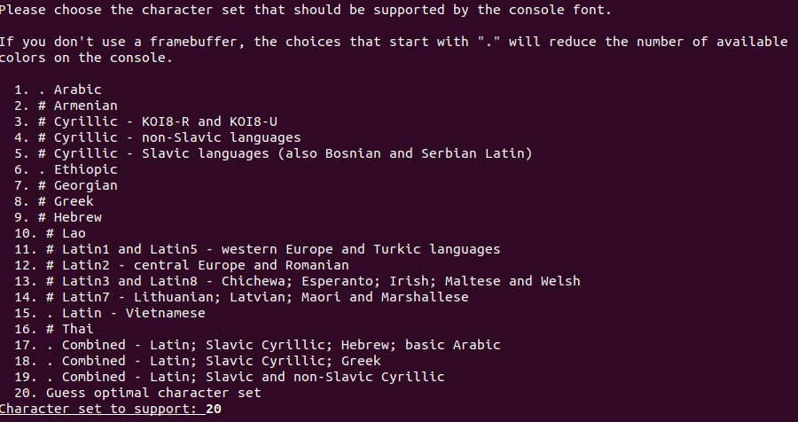

Installation
============

In this manual you will learn to install honeypot (specifically, Dionaea and Cowrie honeypot) using existing docker images that have been created and distributed through github or docker hub.

Preparing The Honeypot Sensor
^^^^^^^^^^^^^^^^^^^^^^^^^^^^^

Cowrie
^^^^^^
Cowrie is a medium interaction honeypot that works on two protocols, Secure Shell (SSH) and Telnet. Cowrie will record any activity that happened in the honeypot throughout the whole session. 

Services and port number list:
Secure Shell (SSH) 	: port 22
Telnet 		        : port 23

In this section, you will learn how to install and run cowrie honeypot using docker. The installation of cowrie is implemented by using existing Dockerfile that is required to be reconfigured before the user builds the docker image. 

Firstly, clone the honeypot Dockerfile by using this command:

.. code-block:: RST

  Docker pull cowrie/cowrie

Then, run the docker image by using this command:

.. code-block:: RST

  Docker run cowrie:devel

At this moment, you would notice that cowrie honeypot us listening on port 2222 for SSH protocol and 2223 for telnet protocol. This however, will not ensure that you will gain any data since those two port numbers are considered as illegitimate ports usage. Thus, a change is needed to set the port number into the default port number for each service. In order to configure the settings of the docker image, you will need to access the docker image as root:

.. code-block:: RST

  docker exec -u 0 -ti container_id /bin/bash

Once you get inside the docker images as root, run this command to install the necessary tools in order to access the settings. 
 
.. code-block:: RST

  Apt-get update
  Apt-get install nano
  Apt-get install authbind

After that, access the “etc” directory inside the “cowrie-git” folder by using this command:

.. code-block:: RST

  Cd /cowrie-git/etc

Now, copy the the configuration file “cowrie.cfg.dist” into “cowrie.cfg” and open it using the command below:

.. code-block:: RST

  cp cowrie.cfg.dist cowrie.cfg
  nano cowrie.cfg

Then, change the configuration in the script:

.. code-block:: RST

  [ssh]
  enabled = true
  listen_endpoints = tcp:22:interface:0.0.0.0

  [telnet]
  enabled = true
  listen_endpoints = tcp:23:interface:0.0.0.0

  [output_hpfeeds]
  enabled = true
  server = ip_address
  port = 10000
  identifier = your_identifier
  secret = your secret
  debug = false

  [output_hpfeeds3]
  enabled = true
  server = ip_address
  port = 10000
  identifier = your_identifier
  secret = your_secret
  debug = false

Add the command above inside the script (“cowrie.cfg” file), save the changes and proceed to build the docker image by going to the path /home/your_user/tpotce/docker. When you reach that path, execute this command to build cowrie’s docker image:

.. code-block:: RST

  sudo docker build cowrie

Once it is finished, you will need to push the repository into docker hub so that you can run it. 
In order to push the docker image into docker hub, you should register yourself in the docker hub website. After that, initiate a docker login by using the command :

.. code-block:: RST

  Docker login --username=your_username --email=your_email@domain.com

If everything worked out, you will get a similar message

.. code-block:: RST

  WARNING: login credentials saved in /home/username/.docker/config.json
  Login Succeeded

Now, you can check your docker image. You will see similar messages 

.. Image

The repository “none” means that your docker image has been successfully built, but does not have any repository yet. Now, you have to push the docker image “none” to your repository. First of all, make sure to create a repository in your docker hub account through the website. Then, using this command to tag the docker image you would like to push into the repository:
docker tag image_id your_username/repo_name:tag_name

After you successfully tag your docker image, push it into the repository by using this command:

.. code-block:: RST

  docker push yourusername/repo_name

Once it is pushed, it will presentate the previously pushed docker image with the name of its repository

Finally, you just need to run the docker image that you have built. Simply enter the command below to run the docker:

.. code-block:: RST

  Sudo docker run image_name:tag_name

Note that if you can run the command without giving any input the tag of the docker image. However, the tag will be considered as latest by default. Therefore, it is recommended to use the complete command to avoid any confusion if you have docker images with the same name but different settings or configuration.

Listening on port 22 and 23
---------------------------

At this moment, you would notice that cowrie honeypot us listening on port 2222 for SSH protocol and 2223 for telnet protocol. This however, will not ensure that you will gain any data since those two port numbers are considered as illegitimate ports usage. Thus, a change is needed to set the port number into the default port number for each service. In order to configure the settings of the docker image, you will need to access the docker image as root:

.. code-block:: RST

  docker exec -u 0 -ti container_id /bin/bash

Once you get inside the docker images as root, run this command to install the necessary tools in order to access the settings. 
 

.. code-block:: RST

  Apt-get update
  Apt-get install nano
  Apt-get install authbind

After that, access the “etc” directory inside the “cowrie-git” folder by using this command:

.. code-block:: RST

  Cd /cowrie-git/etc

Now, copy the the configuration file “cowrie.cfg.dist” into “cowrie.cfg” and open it using the command below:

.. code-block:: RST

  Cp cowrie.cfg.dist cowrie.cfg
  Nano cowrie.cfg

  sudo touch /etc/authbind/byport/23
  sudo chown cowrie:cowrie /etc/authbind/byport/23
  sudo chmod 770 /etc/authbind/byport/23

Port redirection commands are system-wide and need to be executed as root. A firewall redirect can make your existing SSH server unreachable, remember to move the existing server to a different port number first.

The following firewall rule will forward incoming traffic on port 22 to port 2222 on Linux:

.. code-block:: RST

  sudo iptables -t nat -A PREROUTING -p tcp --dport 22 -j REDIRECT --to-port 2222

Or for telnet:

.. code-block:: RST

  sudo iptables -t nat -A PREROUTING -p tcp --dport 23 -j REDIRECT --to-port 2223

.. code-block:: RST

  $ sudo touch /etc/authbind/byport/23
  $ sudo chown cowrie:cowrie /etc/authbind/byport/23
  $ sudo chmod 770 /etc/authbind/byport/23

Dionea
^^^^^^
Dionaea honeypot is a low interaction honeypot that works in multiple protocols that is listed below as well as its default port number:

.. code-block:: RST

  FTP		: port 20/TCP and 21/TCP
  Nameserver	: port 42/TCP
  TFTP		: port 69/UDP
  HTTP		: port 80/TCP 
  HTTPS		: port 443/TCP
  MSRPC		: port 135/TCP
  SNMP		: port 161/UDP
  SMB		: port 445/TCP
  MS-SQL	: port 1433/TCP
  MYSQL		: port 3306/TCP
  SIP		: port 5060/TCP
  SIP-TLS	: port 5061/TCP
  Memcached 	: port 11211 (both TCP and UDP)

In this section, you will learn how to install and run dionaea honeypot using docker. The installation of dionaea is implemented by using existing Dockerfile that is required to be reconfigured for personal use and enabling additional features. 

Firstly, clone the honeypot Dockerfile by using this command:

.. code-block:: RST

  Docker pull dinotools/dionaea-docker

Then, proceed to run the docker image by executing the command provided below:

.. code-block:: RST

  Docker run dinotools/dionaea-docker

After that, access the config folder inside the docker image that has been built as root/administrator account by entering the command : 

.. code-block:: RST

  Docker -u 0 -ti container_id /bin/bash

Once you proceed, enter the folder etc that is located with the specified path /opt/dionaea/etc/dionaea/ihandlers with the command 

.. code-block:: RST

  cd opt/dionaea/etc/dionaea/ihandlers

Once you change your directory there, you need to add “hpfeeds.yaml” inside the ihandlers folder. Inside the ihandler folder, execute this command to add the file “hpfeeds.yaml”. 

.. code-block:: RST

  Sudo nano hpfeeds.yaml

With the command above, it will display an empty file. You need to put these commands in order to implement the changes inside the docker image. 

.. code-block:: RST

  - name: hpfeeds
    config:
    # fqdn/ip and port of the hpfeeds broker
    server: "10.20.100.100"
    port: 10000
    ident: "sensor-dionaea"
    secret: "password1234"
  # dynip_resolve: enable to lookup the sensor ip through a webservice
    dynip_resolve: "http://hpfriends.honeycloud.net/ip"
  # Try to reconnect after N seconds if disconnected from hpfeeds broker
      # reconnect_timeout: 10.0

After that, you need to restart the docker container so that the changes that you have made before are implemented. This can be run through the command :

.. code-block:: RST

  Docker restart container_id

Finally, in order to ensure that the honeypot actually works, you can use net-tools to display which port have been utilized in order to ensure that the honeypot services have been successfully executed. It can be utilized by using this command:

.. code-block:: RST

  Netstat -plnt

After that, make sure every protocol that you enabled in dionaea (all services are enabled by default settings) is listening to the proper port (default port number of each service). You can check it from the screenshot below. To ensure that all of your services provided by dionaea are running on default ports, please refer to the brief explanation of cowrie in the section above.

.. image

Preparing HPFeeds
^^^^^^^^^^^^^^^^^
The followings are the built for HPFeeds (mostly from scratch)

HPFeeds MongoDB Scratch Built 1 Container
^^^^^^^^^^^^^^^^^^^^^^^^^^^^^^^^^^^^^^^^^

The following are the built for HPFeeds from scsratch for 1 container:

1.	First, update your existing list of packages

.. code-block:: RST

  $ sudo apt update

2.	Next install a few prerequisite package

.. code-block:: RST

  $ sudo apt install docker.io

3.	Run mongo docker 

.. code-block:: RST

  $ docker run -d -p 27017-27019:27017-27019 --name mongodb mongo:latest

4.	We can do anything what we want with the docker but first of all it’s always better to update and upgrade the docker first:

.. code-block:: RST

  $ apt-get update && apt-get upgrade -y

5.	After we finish updating and upgrading, we need to install wget git nano sudo:

.. code-block:: RST

  $   apt install -y ubuntu-server wget git nano sudo

6.	Because we install the ubuntu-server there will be some configuration that we should config but for the simplicity sake I have listed below my answer:

.. code-block:: RST

  $   31

.. code-block:: RST

  $ 1

.. code-block:: RST

  $ 1

.. code-block:: RST

  $ 20

7.	We need to clone hpfeeds by typing the command above:

.. code-block:: RST

  $ git clone https://github.com/pwnlandia/mhn.git

8.	Go to mhn/scripts by typing the command above:

.. code-block:: RST

  $ cd mhn/scripts

9.	We need to install hpfeeds by execute this command:

.. code-block:: RST

  $ ./install_hpfeeds.sh

10.	After the installation of hpfeeds we need to install mnemosyne we can do that by executing this:

.. code-block:: RST

  $ ./install_mnemosyne.sh

11.	To check the successful installation and to check the process we can type the command below for checking the hpfeeds process:

.. code-block:: RST

  $ supervisorctl status hpfeeds-broker

and the result can be similar to this:

.. image:: images/hpfeeds-checking-hpfeeds-process.png
   :width: 800

Congrats! You have installed the HPFeeds from Scratch in 1 container!

HPFeeds MongoDB Scratch Built Separate Container
^^^^^^^^^^^^^^^^^^^^^^^^^^^^^^^^^^^^^^^^^^^^^^^^
The following are the built for HPFeeds MongoDB from scratch for separate container:

1.	First, update your existing list of packages

.. code-block:: RST

  $ sudo apt update

2.	Next install a few prerequisite package

.. code-block:: RST

  $ sudo apt install docker.io

3.	Run mongo docker 

.. code-block:: RST

  $ docker run -d -p 27017-27019:27017-27019 --name mongodb mongo:latest

4.	After We run docker mongo we need to run another docker ubuntu for hosting docker HPFeeds we can do that by typing:

.. code-block:: RST

  $ docker run -ti --network=host --name hpfeeds1804 ubuntu:bionic

5.	We can do anything what we want with the docker but first of all it’s always better to update and upgrade the docker first:

.. code-block:: RST

  $ apt-get update && apt-get upgrade -y

6.	After we finish updating and upgrading, we need to install wget git nano sudo:

.. code-block:: RST

  $   apt install -y ubuntu-server wget git nano sudo

7.	Because we install the ubuntu-server there will be some configuration that we should config but for the simplicity sake I have listed below my answer:

.. code-block:: RST

  $   31

.. code-block:: RST

  $ 1

.. code-block:: RST

  $ 1

.. code-block:: RST

  $ 20

8.	We need to clone hpfeeds by typing the command above:

$ git clone https://github.com/pwnlandia/mhn.git

9.	Go to mhn/scripts by typing the command above:

$ cd mhn/scripts

10.	We need to install hpfeeds by execute this command:

$ ./install_hpfeeds.sh

11.	After the installation of hpfeeds we need to install mnemosyne we can do that by executing this:

$ ./install_mnemosyne.sh

12.	To check the successful installation and to check the process we can type the command below for checking the hpfeeds process:

$ supervisorctl status hpfeeds-broker

and the result can be similar to this:

.. image:: images/hpfeeds-checking-hpfeeds-process.png
   :width: 800

Congrats!!! You have built the HPFeeds from Scratch in separate container!

Preparing Honeynet Parsing Engine
^^^^^^^^^^^^^^^^^^^^^^^^^^^^^^^^^

The following are the built of Node-RED from scratch:
1.	First, update your existing list of packages

.. code-block:: RST

  $ sudo apt update

2.	Next install a few prerequisite package

.. code-block:: RST

  $ sudo apt install docker.io

3.	We should create the Ubuntu 18.04 Docker by typing:

.. code-block:: RST

  $ docker run -ti --network=host --name nodered1804 ubuntu:bionic

4.	We can do anything what we want with the docker but first of all it’s always better to update and upgrade the docker first.

.. code-block:: RST

  $ apt-get update && apt-get upgrade -y

5.	After we finish updating and upgrading, we need to install curl sudo

.. code-block:: RST

  $ apt install curl sudo

6.	download and execute the Node.js 10.x installer:

.. code-block:: RST

  $ curl -sL https://deb.nodesource.com/setup_10.x | sudo -E bash -

7.	Install Nodejs 10 by typing:

.. code-block:: RST

  $ sudo apt-get install nodejs nano

8.	After we install the nodejs we can start installing node-RED by typing:

$ npm install -g --unsafe-perm node-red node-red-admin

9.	If the installation success you can try to type:

.. code-block:: RST

  $ node-red

10.	Try to open the web browser with <IP from VM>:1880 (for example = 10.20.100.14:1880) it should be like this:

.. image:: images/empty-interface-nodered.png
   :width: 800

Till this, the installation of Node-RED is successful and we can proceed with the installation of the tools needed in order to parse the hexadecimal to malware by using xxd, check the value of hash by using md5sum and diff and inotify-tools to check for the file.

11.	We have already solved the Node-RED installation. Congratulations to you if you’ve reached this point. Now it’s time to continue the installation of tools that we need to parse the hexadecimal into the ASCII format.

        1. Tools that we need:
           1. Xxd
           2. Inotify-tools for the inotifywait tools
           3. Diffutils for the diff tools
           4. Sed (Installed by default)
           5. Md5sum (Installed by default)

.. code-block:: RST

  $ sudo apt install xxd diffutils inotify-tools nano

12.	After we install all the tools that we need. In appendix provided the script for the bash script utilizing the tools that we already installed. The script name is NewFile.sh but feel free to call it whatever it is and don’t forget to store it at malware directory you can create the malware directory by typing:

.. code-block:: RST

  $ mkdir malware && cd malware

13.	Create a file called NewFile.sh 

.. code-block:: RST

  $ nano NewFile.sh

And add this following bash script: 

.. code-block:: RST

  startCom="Compile start $(date +%c:%N)"
  fileName="$(date +%Y%m%d%s).bin"
  doneCom="Compile finish $(date +%c:%N)"
  inotifywait -m /malware -e create -e moved_to |
  	while read path action file; do
      	echo "The file '$file' appeared in directory '$path' via '$action'"
      	# do something with the file
      	echo `mv $file  parsed/$file.modified`
      	echo "Creating parsed/$file.modified.hash and parsed/$file.modified.mal"
      	echo `sed '2d' parsed/$file.modified > parsed/$file.modified.hash`
      	echo `sed '1d' parsed/$file.modified > parsed/$file.modified.mal`
      	echo "$startCom"
      	echo `xxd -r -p parsed/$file.modified.mal parsed/$file.modified.bin`
      	echo "$doneCom"
      	echo `md5sum parsed/$file.modified.bin | awk '{ print $1 }' > parsed/$file.modified.bin.hash `
      	echo `diff -w parsed/$file.modified.bin.hash parsed/$file.modified.hash && echo "hash check is the same" || “Hash value is different”`
      	# echo "Deleting $file, parsed/$file.modified.mal, parsed/$file.modified.bin.hash, parsed/$file.modified.hash”
      	#echo `rm $file`
      	#echo `rm parsed/$file.modified`
      	#echo `rm parsed/$file.modified.mal`
      	#echo `rm parsed/$file.modified.bin.hash`
      	#echo `rm parsed/$file.modified.hash`
     done

14.	To change the permission, we can simply type this:

.. code-block:: RST

  $  chmod u+x NewFIle.sh

15.	This directory used by inotifywait to generate new file that has been extracted from malware directory and after we have done everything right the malware folder should look like this:

.. code-block:: RST

  $ ll

.. image:: images/list-of-files-and-directory-in-malware-directory.png
   :width: 400

16.	And after we change the permission, we also need to create new directory to store the modified file called parsed we can simply type this:

.. code-block:: RST

  $ mkdir parsed

17.	After that we can run the NewFile.sh by simply typing this:

.. code-block:: RST

  $ ./NewFile.sh

18.	After that we can run the NewFile.sh by simply typing this:

.. image:: images/run-newfilesh-command.png
   :width: 400

Finally, your Node-RED is ready to be use.

Preparing MISP Platform
^^^^^^^^^^^^^^^^^^^^^^^

The following are the steps for installing MISP:
1.	First, update your existing list of packages

.. code-block:: RST

  $ sudo apt update

2.	Next install a few prerequisite package

.. code-block:: RST

  $ sudo apt install apt-transport-https ca-certificates curl software-properties-common

3.	Then add gpg key for the official docker repository to our system

.. code-block:: RST

  $ curl -fsSL https://download.docker.com/linux/ubuntu/gpg | sudo apt-key add -

4.	Add the docker repository to our APT resources

.. code-block:: RST

  $ sudo add-apt-repository "deb [arch=amd64] https://download.docker.com/ linux/ubuntu bionic stable"

5.	Update the package database with docker packages from the new added repo

.. code-block:: RST

  $ sudo apt update

6.	Make sure you are about to install from docker repository instead of the default Ubuntu repo

.. code-block:: RST

  $ apt-cache policy docker-ce
 
7.	You will see output like this, any the version number for each docker may be different (this information notice you that docker-ce not installed, but for installation the docker repository for ubuntu 18 is already

.. code-block:: RST

  docker-ce:
    Installed: (none)
    Candidate: 18.03.1~ce~3-0~ubuntu
    Version table:
       18.03.1~ce~3-0~ubuntu 500
          500 https://download.docker.com/linux/ubuntubionic /stable amd64 Packages
 
8.	Install docker

.. code-block:: RST

  $ sudo apt install docker-ce
 
9.	Docker should now be installed, and the process enabled to start on boot, check that it’s running

.. code-block:: RST

  $ sudo systemctl status docker

The output should be similar to the following, showing that the service is active and running:
Output

.. code-block:: RST

  ● docker.service - Docker Application Container Engine
     Loaded: loaded (/lib/systemd/system/docker.service; enabled; vendor preset: enabled)
     Active: active (running) since Thu 2018-07-05 15:08:39 UTC; 2min 55s ago
       Docs: https://docs.docker.com
   Main PID: 10096 (dockerd)
      Tasks: 16
    CGroup: /system.slice/docker.service
         	├─10096 /usr/bin/dockerd -H fd://
                └─10113 docker-containerd --config /var/run/docker/containerd/containerd.toml

 
10.	To view all available subcommands, type

.. code-block:: RST

  $ docker

11.	This is list of available subcommands includes

.. code-block:: RST

  Output
 
  attach  	Attach local standard input, output, and error streams to a running container
  build   	Build an image from a Dockerfile
  commit  	Create a new image from a container's changes
  cp      	Copy files/folders between a container and the local filesystem
  create  	Create a new container
  diff    	Inspect changes to files or directories on a container's filesystem
  events  	Get real time events from the server
  exec    	Run a command in a running container
  export  	Export a container's filesystem as a tar archive
  history 	Show the history of an image
  images  	List images
  import  	Import the contents from a tarball to create a filesystem image
  info    	Display system-wide information
  inspect 	Return low-level information on Docker objects
  kill    	Kill one or more running containers
  load    	Load an image from a tar archive or STDIN
  login   	Log in to a Docker registry
  logout  	Log out from a Docker registry
  logs    	Fetch the logs of a container
  pause   	Pause all processes within one or more containers
  port    	List port mappings or a specific mapping for the container
  ps      	List containers
  pull    	Pull an image or a repository from a registry
  push    	Push an image or a repository to a registry
  rename  	Rename a container
  restart 	Restart one or more containers
  rm      	Remove one or more containers
  rmi     	Remove one or more images
  run     	Run a command in a new container
  save    	Save one or more images to a tar archive (streamed to STDOUT by default)
  search  	Search the Docker Hub for images
  start   	Start one or more stopped containers
  stats   	Display a live stream of container(s) resource usage statistics
  stop    	Stop one or more running containers
  tag     	Create a tag TARGET_IMAGE that refers to SOURCE_IMAGE
  top     	Display the running processes of a container
  unpause 	Unpause all processes within one or more containers
  update  	Update configuration of one or more containers
  version 	Show the Docker version information
  wait    	Block until one or more containers stop, then print their exit codes

12.	Add misp docker files

.. code-block:: RST

  $ git clone https://github.com/MISP/misp-docker
  $ cd misp-docker

13.	Copy template.env file to .env (on the root directory) and edit the environment variables at .env file

.. code-block:: RST

  $ cp template.env .env
  $ vi .env

14.	Install Prerequisites Files of misp docker

.. code-block:: RST

  $ sudo apt-get install -y libapache2-mod-php php7.2 php7.2-cli php-crypt-gpg php7.2-dev php7.2-json php7.2-mysql php7.2-opcache php7.2-readline php7.2-redis php7.2-xml

15.	Build the misp docker containers

.. code-block:: RST

  $ docker-compose build

Or

.. code-block:: RST

  $ docker-compose -f docker-compose-nginx.yml build
 
16.	Run container misp docker

.. code-block:: RST

  $ docker compose-up

Or

.. code-block:: RST

  $ docker-compose -f docker-compose-nginx.yml up

17.	Build images docker

.. code-block:: RST

  $ sudo docker images

18.	Push your docker images to your docker hub

a.     Login on your account https://hub.docker.com

b.     Click on Create Repository

c.      Choose a name (ex. Mispv2) and a description for your repository and click “Create”

d.     Log into the Docker Hub from your command line

.. code-block:: RST

  $ docker login --username=bssndocker --email=honeyhelp@bssn.go.id

e.     Enter your password when prompted. If everything worked you will get message similar to:

.. code-block:: RST

  Login Succeeded

f.       Check the images ID using, and tag your image ID

.. code-block:: RST

  $ docker images

g.     Tag your image and push image to the repository you created

.. code-block:: RST

  $ sudo docker tag 9845b95deef0 bssndocer/misp:versi1.0
  $ sudo docker push bssndocker/misp
