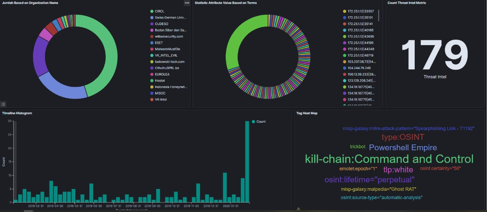

Introduction
============

CSC-ISAC Threat Intelligence Sharing Platform is one of grant project from ISIF Foundation. The goal of the project is to consume information gathers from independent sensors (ex. Honeypots, IDS, Endpoint Detection) 
to have a centralized database and has independent analysis team to be able to share with the cyber security community inside South East Asia Region. 
Our baseline Threat Intelligence Platform based on several open source project such as: 

1. Honeypot
2. MISP (Malware Information Sharing Platform)
3. NodeRed

We Integrate those open source project to cooexist and collaborate together to perform analysis and sharing platform for our community.

Threat Intelligence
^^^^^^^^^^^^^^^^^^^

Threat intelligence is knowledge that allows you to prevent or mitigate cyberattacks. Rooted in data, threat intelligence gives you context that helps you make informed decisions about your security by answering questions like who is attacking you, what their motivations and capabilities are, and what indicators of compromise in your systems to look for.
source: https://www.recordedfuture.com/threat-intelligence-definition/

What is Honeypot
^^^^^^^^^^^^^^^^

A machine that attracts "Attacker". It was made as weak and as interesting as the creator can be to attract the "Attacker" so that the "Attacker" will be interested and injecting something to the honeypot like it was the real machine.

What is Honeynet Parsing Engine
^^^^^^^^^^^^^^^^^^^^^^^^^^^^^^^

An engine to connect all honeypot (conpot, dionea, cowrie, glastopf) and MISP, able to parse log honeypot that has been uniformed by hpfeeds to become the format that accepted by MISP. Able to receive hexadecimal malware that can be parsed to be a binary file that will be sent to MISP according to the related event.

What is MISP
^^^^^^^^^^^^

Malware Information Sharing Platform (MISP) - An Open Source Threat intelligence Sharing Platform is a software facilitates the exchange and sharing of threat intelligence, Indicator of Compromise (IoCs) about targeted malware and attacks, financial fraud or any intelligence within the community of trusted members. MISP sharing is a distributed model containing technical and non-technical information which can be shared within closed, semi-private or open communities. Exchanging such information should result in faster detection of targeted attacks and improve the detection ratio, while also reducing the number of false positives.
There are many objectives for using MISP, such as:

* sharing indicators for a detection matter
* sharing indicators to block
* sharing indicators to perform intelligence

What is X-MISP
^^^^^^^^^^^^^^

X-MISP is our main dashboard as public consumption that shows all the statistics and information related with the Threat Intelligence information gathered from the Sensors and analyzed threat intel. 
We pulled all the data from the central MISP platform and visualize into single Dashboard as shown in the picture below:

Deployment Architecture
^^^^^^^^^^^^^^^^^^^^^^^

Our Architectures considering a scalable environment that can be integrated with various organizations and even researchers that want to contribute with our CSC-ISAC Community. 
The architecture is presented as follows: 

.. image:: images/architecture-design.png
   :width: 800

Disclaimer
^^^^^^^^^^

CSC-ISAC Threat Intelligence Platform is distributed as it is, in the hope that it will be useful, but without any warranty neither the implied merchantability or fitness for a particular purpose.

Whatever you do with this tool is uniquely your own responsibility.

Community Guidelines
^^^^^^^^^^^^^^^^^^^^

The `CSC-ISAC <https://cscisac.org>`_ (Cyber Security Community - Information Sharing and Analysis Center) Organization is a non-profit organization incorporated as a Stichting in the Indonesia and it’s mainly dedicated to support of the development and growth of Threat Intelligence Sharing & Analysis Community across Asia Pasific Region, specifically in integration with honeypot installation and other open source platform

The organization is initally funded by ISIF Grants and operates to secure financial and infrastructure support to our software projects and coordinates the development and contributions from the community.