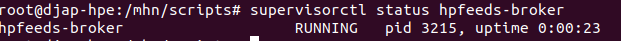
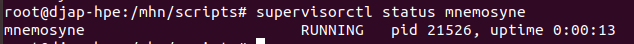
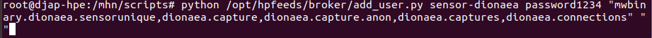
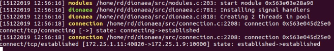
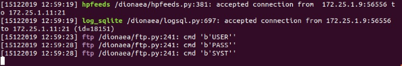
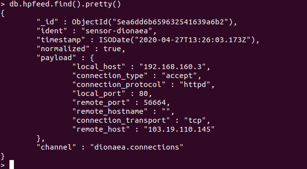
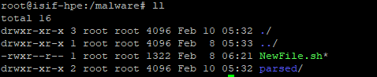
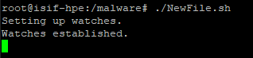

Usage
=====

In this manual you will learn to use the honeypot (specifically, HPFeeds and MISP with the community) using existing docker images that have been created and distributed through github or docker hub.

Starting HPFeeds & Honeypot Parsing Engine
^^^^^^^^^^^^^^^^^^^^^^^^^^^^^^^^^^^^^^^^^^
The following are the steps of how to start to use HPFeeds and HPE.

Start Using HPFeeds that Built from Scratch for 1 Container and Separate Container
^^^^^^^^^^^^^^^^^^^^^^^^^^^^^^^^^^^^^^^^^^^^^^^^^^^^^^^^^^^^^^^^^^^^^^^^^^^^^^^^^^
The following are the steps for using HPFeeds MongoDB for 1 container and separate container:

1.	To check the successful installation and to check the process we can type the command below for checking the hpfeeds process:

.. code-block:: RST

  $ supervisorctl status hpfeeds-broker

and the result can be similar to this:

2.	To check the process of the mnemosyne we can type the command below:

.. code-block:: RST

  $ supervisorctl status mnemosyne

3.	Then we should install pymongo to be able to run the add_user.py

.. code-block:: RST

  $ pip install pymongo

4.	 To add the ident and secret we can do the command below for each honeypot there is different channel, for now we will be focussing on dionaea Honeypot.

.. code-block:: RST

  $ python /opt/hpfeeds/broker/add_user.py sensor-dionaea(according to ident at hpfeeds.yaml) password1234(according to secret at hpfeeds.yaml) "mwbinary.dionaea.sensorunique,dionaea.capture,dionaea.capture.anon,dionaea.captures,dionaea.connections" " "

5.	Then we need to add the python script that is monitoring the MongoDB and send the JSON data when the data arrived at MongoDB

.. code-block:: RST

  $ nano py123.py

And add this following python script: 

Modify the URL into the URL of your Node-RED IP 

.. code-block:: RST

  from pymongo import Connection
  import time
  import requests
  import json
  url = 'http://192.168.1.100:1880/test'
  db = Connection().mnemosyne
  coll = db.hpfeed
  cursor = coll.find(tailable=True)
  while cursor.alive:
  	try:
      	doc = cursor.next()
      	test = json.dumps(doc, indent=4, default=str)
      	print (test)
      	response = requests.post(url, data=test)
  	except StopIteration:
      	time.sleep(1)

6.	Then we need to execute the python script by typing:

.. code-block:: RST

  $ python3 py123.py

7.	Then at the dionaea we should modify the hpfeed Edit the hpfeeds.yaml at /opt/dionaea/etc/dionaea/ihandlers-available:

.. code-block:: RST

  $ nano /opt/dionaea/etc/dionaea/ihandlers-available/hpfeeds.yaml

.. image:: images/hpfeeds-edit-hpfeeds.yaml.png
   :width: 600

Edit it like this, after that copy the hpfeeds.yaml to /opt/Dionaea/etc/Dionaea/ihandlers-enabled.

.. code-block:: RST

  $ cd /opt/dionaea/etc/dionaea/ihandlers-available/hpfeeds.yaml /opt/dionaea/etc/dionaea/ihandlers-enabled

8.	Restart the Dionaea and the result will be like this:

9.	We do the attack via ftp to Dionaea and the result will be:

10.	The result of MongoDB should be like this:

Starting Honeypot Parsing Engine
^^^^^^^^^^^^^^^^^^^^^^^^^^^^^^^^

1.	Now it’s time to continue the installation of tools that we need to parse the hexadecimal into the ASCII format.

   1. Tools that we need:

      1. Xxd
      2. Inotify-tools for the inotifywait tools
      3. Diffutils for the diff tools
      4. Sed (Installed by default)
      5. Md5sum (Installed by default)

.. code-block:: RST

  $ sudo apt install xxd diffutils inotify-tools nano

2.	After we install all the tools that we need. In appendix provided the script for the bash script utilizing the tools that we already installed. The script name is NewFile.sh but feel free to call it whatever it is and don’t forget to store it at malware directory you can create the malware directory by typing:

.. code-block:: RST

  $ mkdir malware && cd malware

3.	Create a file called NewFile.sh 

.. code-block:: RST

  $ nano NewFile.sh

And add this following bash script: 

.. code-block:: RST

  startCom="Compile start $(date +%c:%N)"
  fileName="$(date +%Y%m%d%s).bin"
  doneCom="Compile finish $(date +%c:%N)"
  inotifywait -m /malware -e create -e moved_to |
  	while read path action file; do
      	echo "The file '$file' appeared in directory '$path' via '$action'"
      	# do something with the file
      	echo `mv $file  parsed/$file.modified`
      	echo "Creating parsed/$file.modified.hash and parsed/$file.modified.mal"
      	echo `sed '2d' parsed/$file.modified > parsed/$file.modified.hash`
      	echo `sed '1d' parsed/$file.modified > parsed/$file.modified.mal`
      	echo "$startCom"
      	echo `xxd -r -p parsed/$file.modified.mal parsed/$file.modified.bin`
      	echo "$doneCom"
      	echo `md5sum parsed/$file.modified.bin | awk '{ print $1 }' > parsed/$file.modified.bin.hash `
      	echo `diff -w parsed/$file.modified.bin.hash parsed/$file.modified.hash && echo "hash check is the same" || “Hash value is different”`
      	# echo "Deleting $file, parsed/$file.modified.mal, parsed/$file.modified.bin.hash, parsed/$file.modified.hash”
      	#echo `rm $file`
      	#echo `rm parsed/$file.modified`
      	#echo `rm parsed/$file.modified.mal`
      	#echo `rm parsed/$file.modified.bin.hash`
      	#echo `rm parsed/$file.modified.hash`
     done

4.	To change the permission, we can simply type this:

.. code-block:: RST

  $  chmod u+x NewFIle.sh

5.	This directory used by inotifywait to generate new file that has been extracted from malware directory and after we have done everything right the malware folder should look like this:

.. code-block:: RST

  $ ll

6.	And after we change the permission, we also need to create new directory to store the modified file called parsed we can simply type this:

.. code-block:: RST

  $ mkdir parsed

7.	After that we can run the NewFile.sh by simply typing this:

.. code-block:: RST

  $ ./NewFile.sh

8.	After that we can run the NewFile.sh by simply typing this:

Starting MISP
^^^^^^^^^^^^^

1.	Run container misp docker

.. code-block:: RST

  $ docker compose-up

Or

.. code-block:: RST

  $ docker-compose -f docker-compose-nginx.yml up

2.	Build images docker

.. code-block:: RST

  $ sudo docker images

3.	Push your docker images to your docker hub

a.     Login on your account https://hub.docker.com

b.     Click on Create Repository

c.      Choose a name (ex. Mispv2) and a description for your repository and click “Create”

d.     Log into the Docker Hub from your command line

.. code-block:: RST

  $ docker login --username=bssndocker --email=honeyhelp@bssn.go.id

e.     Enter your password when prompted. If everything worked you will get message similar to:

.. code-block:: RST

  Login Succeeded

f.       Check the images ID using, and tag your image ID

.. code-block:: RST

  $ docker images

g.     Tag your image and push image to the repository you created

.. code-block:: RST

  $ sudo docker tag 9845b95deef0 bssndocer/misp:versi1.0
  $ sudo docker push bssndocker/misp
